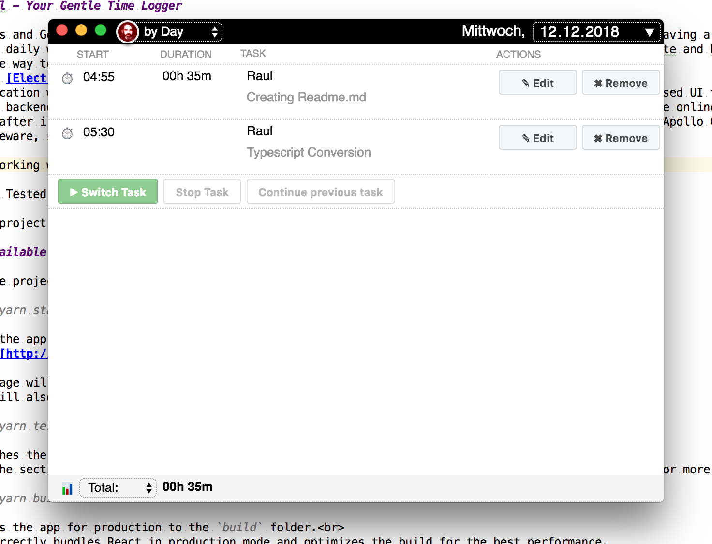

# Raúl - Your Gentle Time Logger

Ladies and Gentlemen, let me introduce you to Raúl. In May 2018 my favorite timelogger went offline, leaving a big gap 
in my daily workflow. So i started to build my own in 15 minutes sprints in the S-Bahn between Wien-Mitte and Hetzendorf,
on the way to work. Pretty soon I had a functional prototype. 

Using [Electron](https://electronjs.org) i built a desktop
application with a backend importer of redmine tickets / projects, in the frontend a i built a React based UI to 
record the time entries, and a backend job to sync these entries back to Redmine (It's an async process, 
it should sync when you're online). 

Soon after i had a working prototype i started to decouple it from Redmine, adding an Express.js based Apollo GraphQl
middleware, so theoretically it's  capable to log time to any data you can import via GraphQl (Github Issues, 
Trello Data, ..). 

I'm working with a fully functional prototype every day. 

And I indend to release it, open source it. However, there are still some important milestones left to reach that 
goal. I recently started to convert the source code of frontend and backend process into Typescript (In side projects
I'm usually using technology i want to build up knowledge about). Converting
a historically grown project takes some time, which is a problem, when there's lack of. While converting the 
backend from vanillaJS to Typescript went quick, converting the UI was more challenging.
So decided to convert it step by step, first with reduced functionality, as own component, and while i'm still 
in that process (Only a part works so far, data is static, you can't add, change, delete data, there's no backend, 
no tests, all that will follow step by step), i would be eager to hear 
from Typescript experts, what i should improve, do differently. That's why i created this repository with the 
most important UI component of Raul, the list of daily time entries.

Note: Please use Chrome to check it (Target is Electron, which uses Chromium)
 
This project was bootstrapped with [Create React App](https://github.com/facebook/create-react-app).

## Available Scripts

In the project directory, you can run:

### `yarn start`

Runs the app in the development mode. 
Open [http://localhost:3000](http://localhost:3000) to view it in the browser.

The page will reload if you make edits. 
You will also see any lint errors in the console.

### `yarn test`

Launches the test runner in the interactive watch mode. 
See the section about [running tests](https://facebook.github.io/create-react-app/docs/running-tests) for more information.

### `yarn build`

Builds the app for production to the `build` folder. 
It correctly bundles React in production mode and optimizes the build for the best performance.

The build is minified and the filenames include the hashes. 
Your app is ready to be deployed!

See the section about [deployment](https://facebook.github.io/create-react-app/docs/deployment) for more information.

### `yarn run eject`

**Note: this is a one-way operation. Once you `eject`, you can’t go back!**

If you aren’t satisfied with the build tool and configuration choices, you can `eject` at any time. This command will remove the single build dependency from your project.

Instead, it will copy all the configuration files and the transitive dependencies (Webpack, Babel, ESLint, etc) right into your project so you have full control over them. All of the commands except `eject` will still work, but they will point to the copied scripts so you can tweak them. At this point you’re on your own.

You don’t have to ever use `eject`. The curated feature set is suitable for small and middle deployments, and you shouldn’t feel obligated to use this feature. However we understand that this tool wouldn’t be useful if you couldn’t customize it when you are ready for it.

## Learn More

You can learn more in the [Create React App documentation](https://facebook.github.io/create-react-app/docs/getting-started).

To learn React, check out the [React documentation](https://reactjs.org/).
